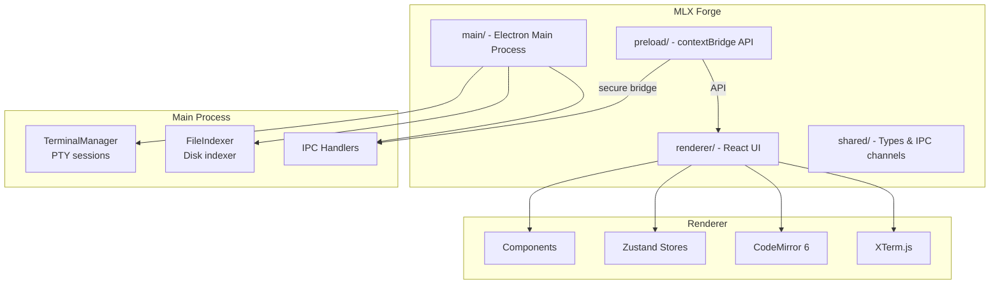

# MLX

**Make. Learn. eXtraordinary.** — AI 驱动的 Windows 桌面 IDE，集成双终端、代码编辑器、文件管理、对话管理和提示词管理。

    

---

## ✨ Features

- **Dual Terminal System** — Run Opencode and Claude side by side in PowerShell PTY terminals
- **Code Editor** — CodeMirror 6 with 40+ language syntax highlighting
- **File Browser** — Traditional file explorer with right-click context menu, rename, delete, slow-double-click rename (Windows style)
- **File Search** — Full-disk file name indexing and search (Everything-style)
- **Content Search** — Cross-file text search across your project (`Ctrl+Shift+F`)
- **Conversation Manager** — Browse, view, and resume Claude and Opencode conversations with token usage statistics
- **Prompt Manager** — Hierarchical prompt library stored as `.md` files, with view/edit/create/delete (`Ctrl+Shift+M`)
- **Keyboard Shortcuts** — Comprehensive shortcut system, press `Ctrl+Shift+/` to view all
- **Panel System** — Drag-to-reorder panels, resizable layout, multiple layout modes
- **Theme System** — 3 built-in themes (Dark/Light/High Contrast) + custom theme editor

---

## 🚀 Quick Start

### Download & Run

Download the latest portable executable from the [Releases](https://github.com/miaoluxin/MLXHOME/releases) page, double-click to run — no installation required.

### Build from Source

```bash
# Prerequisites: Node.js 20+, Git

git clone https://github.com/miaoluxin/MLXHOME.git
cd MLX_Tool_Git

npm install
npm run electron:build:win
```

The portable executable will be at `release\mlx-1.0.0-portable.exe`.

### Development Mode

```bash
npm run dev
```

---

## ⌨️ Keyboard Shortcuts / 快捷键

| Shortcut | Action | 功能 |
|----------|--------|------|
| `Ctrl+B` | Toggle File Browser | 切换文件浏览器 |
| `Ctrl+Shift+F` | Toggle Content Search | 内容搜索 |
| `Ctrl+Shift+M` | Toggle Prompt Manager | 提示词管理 |
| `Ctrl+Shift+P` | Switch Project | 切换项目 |
| `Ctrl+Shift+/` | Show Keyboard Shortcuts | 快捷键帮助 |
| `Ctrl+N` | New File | 新建文件 |
| `Ctrl+O` | Open File | 打开文件 |
| `Ctrl+S` | Save | 保存 |
| `Ctrl+W` | Close Tab | 关闭标签 |
| `Ctrl+F` | Find | 查找 |
| `Ctrl+H` | Find & Replace | 查找替换 |
| `F2` | Rename (file browser) | 重命名 |
| `Delete` | Delete (file browser) | 删除 |

---

## 🛠 Tech Stack / 技术栈

| Layer | 层 | Technology |
|-------|-------|-----------|
| Desktop Framework | 桌面框架 | Electron 43 |
| UI | 用户界面 | React 19 + TypeScript 5.8 |
| Build | 构建 | Vite 6 + vite-plugin-electron |
| Terminal | 终端 | xterm.js 5.3 + @lydell/node-pty |
| Editor | 编辑器 | CodeMirror 6 (15 language packages) |
| State Management | 状态管理 | Zustand 5 (11 stores) |
| Animation | 动画 | Framer Motion 12 |
| Styling | 样式 | Tailwind CSS 3 + CSS custom properties |
| File Watching | 文件监听 | chokidar 4 |
| Packaging | 打包 | electron-builder 25 (portable exe) |

---

## 📁 Project Structure



---

## 🤝 Contributing

See [CONTRIBUTING.md](CONTRIBUTING.md) for contribution guidelines.

## 📄 License

[MIT](LICENSE)
