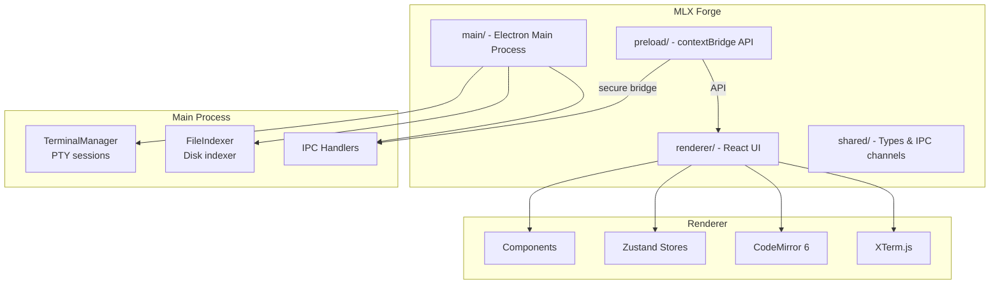

# MLX Forge

**Make. Learn. eXtraordinary.** — An AI-powered Windows desktop IDE with integrated terminal, code editor, file manager, conversation history, and prompt management.

    

---

## ✨ Features

- **Dual Terminal System** — Run Opencode and Claude side by side in PowerShell PTY terminals
- **Code Editor** — CodeMirror 6 with 40+ language syntax highlighting
- **File Browser** — Traditional file explorer with right-click context menu, rename, delete, slow-double-click rename (Windows style)
- **File Search** — Full-disk file name indexing and search (Everything-style)
- **Content Search** — Cross-file text search across your project (`Ctrl+Shift+F`)
- **Conversation Manager** — Browse, view, and resume Claude and Opencode conversations with token usage statistics
- **Prompt Manager** — Hierarchical prompt library stored as `.md` files, with view/edit/create/delete (`Ctrl+Shift+M`)
- **Keyboard Shortcuts** — Comprehensive shortcut system, press `Ctrl+Shift+/` to view all
- **Panel System** — Drag-to-reorder panels, resizable layout, multiple layout modes
- **Theme System** — 3 built-in themes (Dark/Light/High Contrast) + custom theme editor

---

## 🚀 Quick Start

### Download & Run

Download the latest portable executable from the [Releases](https://github.com/mlxforge/MLX-Forge/releases) page, double-click to run — no installation required.

### Build from Source

```bash
# Prerequisites: Node.js 20+, Git

git clone https://github.com/mlxforge/MLX-Forge.git
cd MLX-Forge

npm install
npm run build
npx electron-builder --win
```

The portable executable will be at `release\mlxforge-1.0.0-portable.exe`.

### Development Mode

```bash
npm run dev
```

---

## ⌨️ Keyboard Shortcuts

| Shortcut | Action |
|----------|--------|
| `Ctrl+B` | Toggle File Browser |
| `Ctrl+Shift+F` | Toggle Content Search |
| `Ctrl+Shift+M` | Toggle Prompt Manager |
| `Ctrl+Shift+P` | Switch Project |
| `Ctrl+Shift+/` | Show Keyboard Shortcuts |
| `Ctrl+N` | New File |
| `Ctrl+O` | Open File |
| `Ctrl+S` | Save |
| `Ctrl+W` | Close Tab |
| `Ctrl+F` | Find |
| `Ctrl+H` | Find & Replace |
| `F2` | Rename (file browser) |
| `Delete` | Delete (file browser) |

---

## 🛠 Tech Stack

| Layer | Technology |
|-------|-----------|
| Desktop Framework | Electron 43 |
| UI | React 19 + TypeScript 5.8 |
| Build | Vite 6 + vite-plugin-electron |
| Terminal | xterm.js 5.3 + @lydell/node-pty |
| Editor | CodeMirror 6 (15 language packages) |
| State Management | Zustand 5 (9 stores) |
| Animation | Framer Motion 12 |
| Styling | Tailwind CSS 3 + CSS custom properties |
| File Watching | chokidar 4 |
| Packaging | electron-builder 25 (portable exe) |

---

## 📁 Project Structure



---

## 🤝 Contributing

See [CONTRIBUTING.md](CONTRIBUTING.md) for contribution guidelines.

## 📄 License

[MIT](LICENSE)
