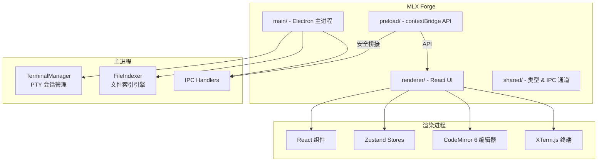

# MLX

**Make. Learn. eXtraordinary.** — AI 驱动的 Windows 桌面 IDE，集成双终端、代码编辑器、文件管理、对话管理和提示词管理。

    

---

## ✨ 核心功能

- **双终端系统** — Opencode + Claude 并行运行，PowerShell PTY 支持
- **代码编辑器** — CodeMirror 6 引擎，40+ 语言语法高亮
- **文件浏览器** — 传统文件树 + 右键菜单 + 重命名/删除 + Windows 风格慢双击改名
- **文件搜索** — 全盘文件名索引搜索（对标 Everything）
- **内容搜索** — 跨文件文本内容搜索（`Ctrl+Shift+F`）
- **对话管理** — 浏览/查看/恢复 Claude 和 Opencode 对话，Token 用量统计
- **提示词管理** — 分层目录式提示词库，.md 文件存储，支持查看/编辑/新建/删除（`Ctrl+Shift+M`）
- **快捷键系统** — 完整快捷键体系，`Ctrl+Shift+/` 查看全部
- **面板系统** — 拖拽排序、自由调整大小、多种布局模式
- **主题系统** — 3 套内置主题（暗黑/白黑/高对比度）+ 自定义主题编辑器

---

## 🚀 快速开始

### 下载即用

从 [Releases](https://github.com/miaoluxin/MLXHOME/releases) 页面下载最新便携版 exe，双击运行，无需安装。

### 从源码构建

```bash
# 前置条件：Node.js 20+, Git

git clone https://github.com/miaoluxin/MLXHOME.git
cd MLX_Tool_Git

npm install
npm run electron:build:win
```

便携版产物位于 `release\mlx-1.0.0-portable.exe`。

### 开发模式

```bash
npm run dev
```

---

## ⌨️ 快捷键

| 快捷键 | 功能 |
|--------|------|
| `Ctrl+B` | 切换文件浏览器 |
| `Ctrl+Shift+F` | 内容搜索 |
| `Ctrl+Shift+M` | 提示词管理 |
| `Ctrl+Shift+P` | 切换项目 |
| `Ctrl+Shift+/` | 快捷键帮助 |
| `Ctrl+N` | 新建文件 |
| `Ctrl+O` | 打开文件 |
| `Ctrl+S` | 保存 |
| `Ctrl+W` | 关闭标签 |
| `Ctrl+F` | 查找 |
| `Ctrl+H` | 查找替换 |
| `F2` | 重命名（文件浏览器） |
| `Delete` | 删除（文件浏览器） |

---

## 🛠 技术栈

| 层 | 技术 |
|-------|-----------|
| 桌面框架 | Electron 43 |
| UI | React 19 + TypeScript 5.8 |
| 构建 | Vite 6 + vite-plugin-electron |
| 终端 | xterm.js 5.3 + @lydell/node-pty |
| 编辑器 | CodeMirror 6（15 个语言包） |
| 状态管理 | Zustand 5（9 个 Store） |
| 动画 | Framer Motion 12 |
| 样式 | Tailwind CSS 3 + CSS 自定义属性 |
| 文件监听 | chokidar 4 |
| 打包 | electron-builder 25（便携版 exe） |

---

## 📁 项目结构



---

## 🤝 贡献指南

详见 [CONTRIBUTING.md](CONTRIBUTING.md)。

## 📄 许可证

[MIT](LICENSE)
