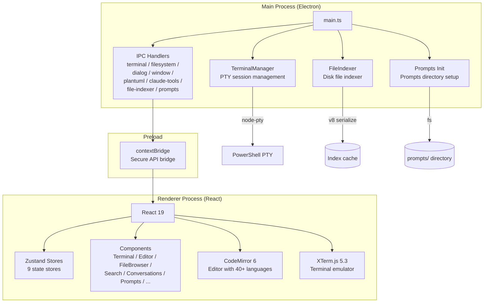
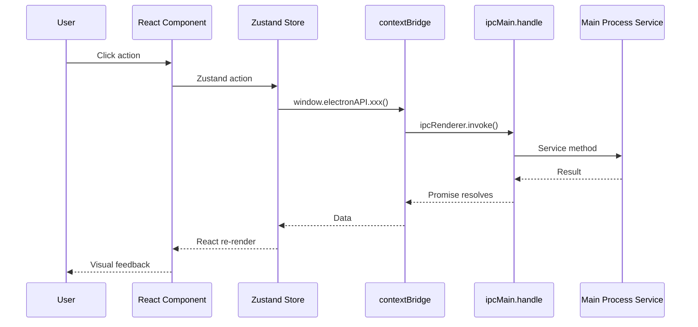
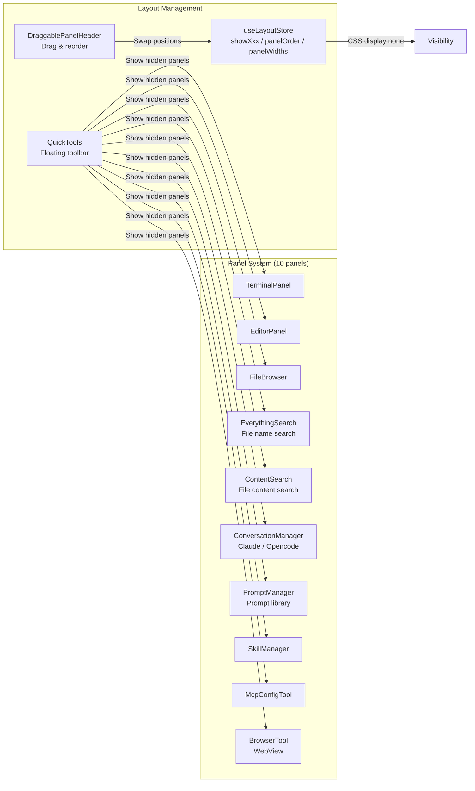

# MLX Forge Architecture

## System Architecture

## Process Model

MLX Forge follows the standard Electron security model:

| Layer | Process | Responsibilities |
|-------|---------|-----------------|
| Main | Node.js | Window management, native APIs, child processes, file I/O |
| Renderer | Chromium | UI rendering, user interaction |
| Preload | Isolated | Secure `contextBridge.exposeInMainWorld` API |

All IPC is strictly typed through `ipc-channels.ts` and `electron.d.ts`.

## Data Flow

## Panel System

## Store Architecture

| Store | State | Key Actions |
|-------|-------|-------------|
| `useProjectStore` | projectPath, onboarding | setProjectPath, completeOnboarding |
| `useLayoutStore` | showXxx, panelOrder, widths | toggleFileBrowser, swapPanels |
| `useEditorStore` | openFiles, activeFileId | openFile, closeFile, batchRestore |
| `useTerminalStore` | sessions, activeId | addSession, closeSession |
| `useFileStore` | currentPath, entries | setCurrentPath, setEntries |
| `useThemeStore` | current, customThemes | setTheme, addCustomTheme |
| `useConversationStore` | conversations, messages | loadConversations, selectConversation |
| `usePromptStore` | entries, view, editContent | loadTree, selectPrompt, saveEdit |
| `useFileClipboardStore` | paths, operation | setClipboard, clearClipboard |
| `usePluginStore` | installed, active | setBuiltin, installPlugin |
| `useFavoritesStore` | favorites | addFavorite, removeFavorite |
