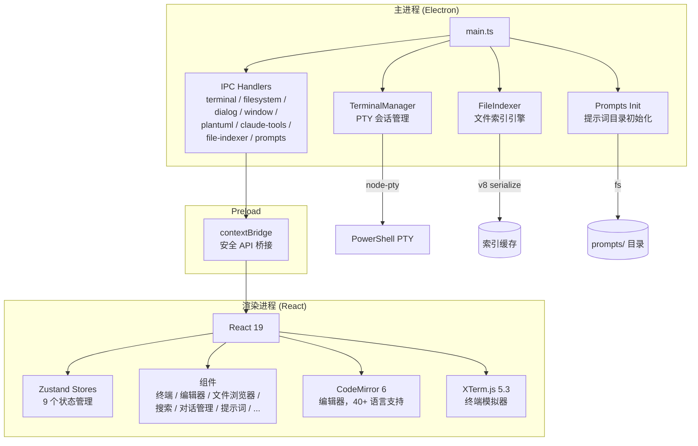
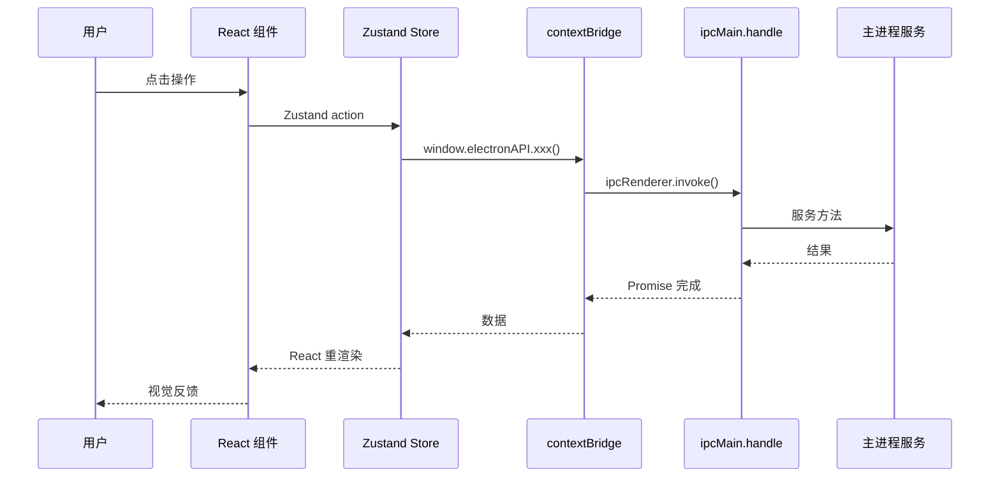
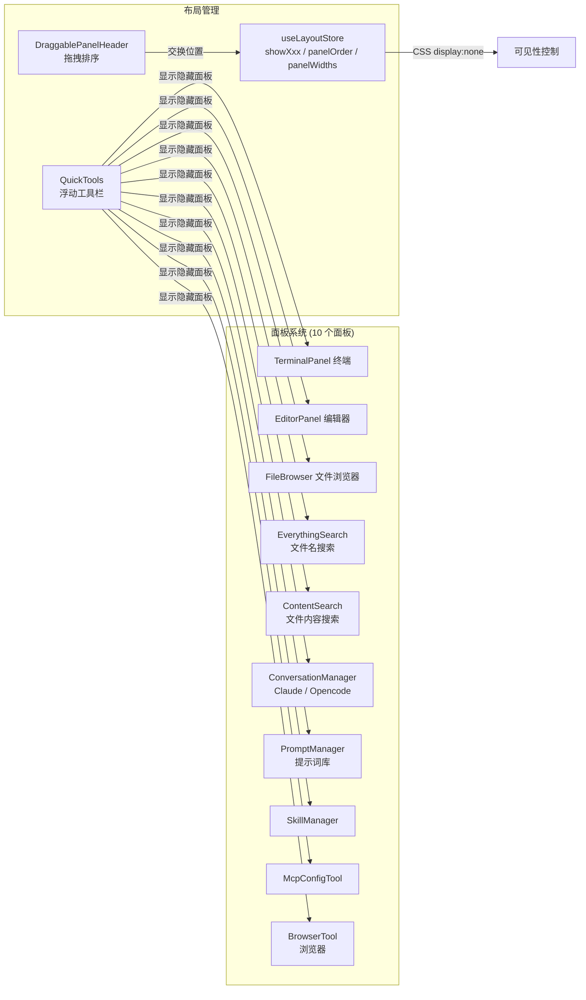

# MLX 架构设计

## 系统架构

## 进程模型

| 层 | 进程 | 职责 |
|-------|---------|-----------------|
| Main | Node.js | 窗口管理、原生 API、子进程、文件 I/O |
| Renderer | Chromium | UI 渲染、用户交互 |
| Preload | 隔离环境 | 安全的 `contextBridge.exposeInMainWorld` API |

所有 IPC 通过 `ipc-channels.ts` 和 `electron.d.ts` 严格类型化。

## 数据流

## 面板系统

## Store 架构

| Store | 状态 | 关键方法 |
|-------|-------|-------------|
| `useProjectStore` | projectPath, onboarding | setProjectPath, completeOnboarding |
| `useLayoutStore` | showXxx, panelOrder, widths | toggleFileBrowser, swapPanels |
| `useEditorStore` | openFiles, activeFileId | openFile, closeFile, batchRestore |
| `useTerminalStore` | sessions, activeId | addSession, closeSession |
| `useFileStore` | currentPath, entries | setCurrentPath, setEntries |
| `useThemeStore` | current, customThemes | setTheme, addCustomTheme |
| `useConversationStore` | conversations, messages | loadConversations, selectConversation |
| `usePromptStore` | entries, view, editContent | loadTree, selectPrompt, saveEdit |
| `useFileClipboardStore` | paths, operation | setClipboard, clearClipboard |
| `usePluginStore` | installed, active | setBuiltin, installPlugin |
| `useFavoritesStore` | favorites | addFavorite, removeFavorite |
