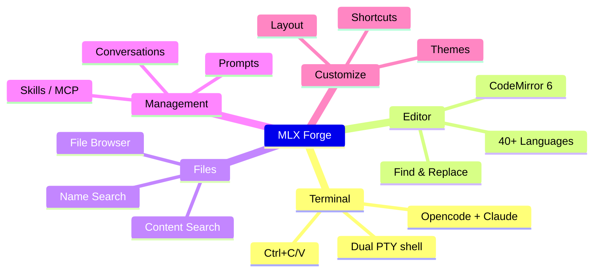
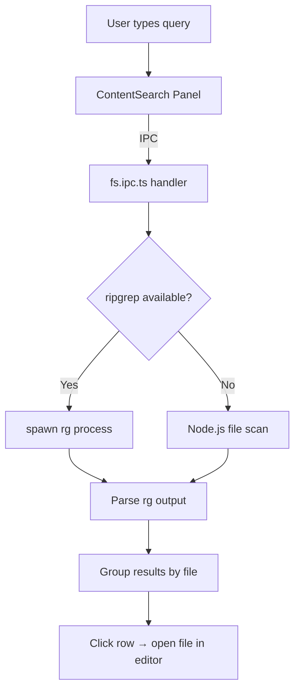
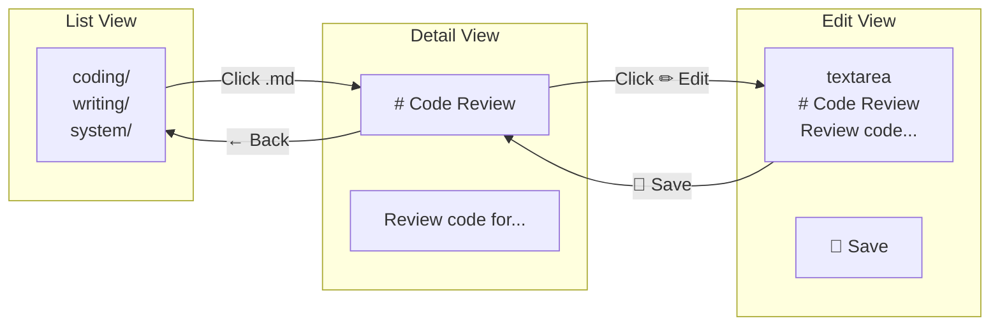

# MLX Forge — Feature Guide



## 1. 🖥️ Dual Terminal System

Run Opencode and Claude CLI tools side by side in separate PowerShell PTY terminals.

```
┌─────────────────────────────────────┐
│ [Opencode] [Claude] [+]             │  ← Terminal tabs
├─────────────────────────────────────┤
│ Opencode v1.18 ready                │
│ > _                                │  ← Active terminal
└─────────────────────────────────────┘
```

**Architecture:**

```mermaid
graph LR
    subgraph "Renderer"
        XT[XTerm.js 5.3]
        TP[TerminalPanel]
    end
    subgraph "Main Process"
        TM[TerminalManager<br/>PTY Manager]
        NP[@lydell/node-pty]
    end
    subgraph "OS"
        PS[PowerShell]
        OC[opencode CLI]
        CL[claude CLI]
    end
    TP -->|IPC| TM
    TM --> NP
    NP --> PS
    PS --> OC & CL
    PS -->|stdout| NP
    NP -->|onData IPC| XT
```

- **Auto-start**: Opens opencode immediately; Claude starts 3 seconds later
- **New Terminal**: Click `+` to choose Claude, Opencode, or a custom command
- **Ctrl+C**: Copy selected text (no selection = send SIGINT)
- **Ctrl+V**: Paste from clipboard
- **Right-click**: Copy/paste context menu

**Keyboard**: `F2` rename tab, toggle panels with layout controls

---

## 2. 📝 Code Editor (CodeMirror 6)

Full-featured code editor powered by CodeMirror 6 with 40+ language packages.

```
┌─────────────────────────────────────┐
│ [index.ts] [style.css] [+]          │  ← Editor tabs
├─────────────────────────────────────┤
│ import { useState } from 'react';   │
│                                     │
│ function App() {                    │  ← Syntax highlighting
│   return <div>Hello</div>           │
│ }                                   │
├─────────────────────────────────────┤
│ Ln:1 Col:1 UTF-8 LF  TypeScript   │  ← Status bar
└─────────────────────────────────────┘
```

- **Find & Replace** (`Ctrl+F`, `Ctrl+H`)
- **Column Selection** (Alt+drag)
- **Word Wrap**, **Hex Viewer**, **Line Operations**
- **Zoom** (`Ctrl+=` / `Ctrl+-`)
- **Markdown/PlantUML Preview** (Alt+M / Alt+U)

---

## 3. 📂 File Browser

Traditional file explorer with Windows Explorer-like interactions.

- **Right-click**: New file, new folder, rename, delete, copy, cut, paste
- **Slow double-click**: Click once to select, wait ~1s, click again to rename
- **F2**: Rename selected item
- **Delete**: Delete selected item
- **Auto-refresh**: Automatically detects file system changes via chokidar
- **Refresh button**: Manual refresh in toolbar

---

## 4. 🔍 File Search (EverythingSearch)

Full-disk file name indexing and search, similar to Everything by Voidtools.

- **Index engine**: Memory-based Map index, persisted to disk via v8 serialization
- **First scan**: 30-60s (background, non-blocking)
- **Subsequent starts**: 1-3s (load cached index)
- **Search query**: 1-50ms response time
- **Right-click**: Show in folder, copy path, copy file, cut, rename

---

## 5. 🔎 Content Search (`Ctrl+Shift+F`)

Cross-file text search across your entire project.



- **Engine**: ripgrep (rg) with Node.js fallback
- **Search scope**: All text files in project directory
- **Results**: Grouped by file, expand to see individual matches with line numbers
- **Click**: Opens match in editor
- **Indexed delay**: Starts 10s after app launch

---

## 6. 💬 Conversation Manager

Browse, view, and resume Claude and Opencode conversations.

```
┌─────────────────────────────────────┐
│ [Claude] [Opencode]                 │  ← Tool tabs
├─────────────────────────────────────┤
│ Project Architecture Analysis       │
│ 2026-07-22 · 12 messages           │  ← Session list
│ Bug Fix Discussion                  │
│ 2026-07-21 · 8 messages            │
└─────────────────────────────────────┘
```

- **Claude tab**: Reads from `~/.claude/` (history.jsonl + project sessions)
- **Opencode tab**: Reads from `opencode` SQLite database
- **Detail view**: Message bubbles with token usage statistics
- **Resume**: Click "Resume" → command auto-entered into active terminal
- **Export**: Export conversation as Markdown

---

## 7. 💡 Prompt Manager (`Ctrl+Shift+M`)

Hierarchical prompt library stored as `.md` files in a `prompts/` directory.



```
┌─────────────────────────────────────┐
│ coding/                             │
│ ├── Code Review                     │  ← Click to view
│ └── Refactoring Guide               │
│ writing/                            │
│ └── Article Polish                  │
│ [+] New  [Group]  [Refresh]         │
└─────────────────────────────────────┘
```

- **Three views**: List → Detail (rendered Markdown) → Edit (textarea)
- **Right-click**: New prompt, new folder, rename, delete
- **Persistence**: `.md` files at `prompts/` next to the executable

---

## 8. 🎨 Theme System

3 built-in themes + custom theme editor.

| Theme | Description |
|-------|-------------|
| Dark | Tokyo Night style — deep navy blue |
| Light | GitHub Light — clean white |
| High Contrast | Deep blue + cyan accents |

**Custom themes**: Edit 19 color variables + font sizes in real-time.

---

## 9. ⌨️ Keyboard Shortcuts

`Ctrl+Shift+/` opens the shortcut help panel at any time.

| Shortcut | Action |
|----------|--------|
| `Ctrl+B` | Toggle File Browser |
| `Ctrl+Shift+F` | Toggle Content Search |
| `Ctrl+Shift+M` | Toggle Prompt Manager |
| `Ctrl+Shift+P` | Switch Project |
| `Ctrl+Shift+/` | Show Shortcut Help |
| `Ctrl+N/O/S/W` | File operations |

---

## 10. 🔧 Tools Panel

Additional tools available through the View menu or QuickTools:

- **Skill Manager**: Browse/install/delete Claude skills
- **MCP Config**: View and edit MCP server configuration
- **Browser**: Simple webview browser with bookmarks
