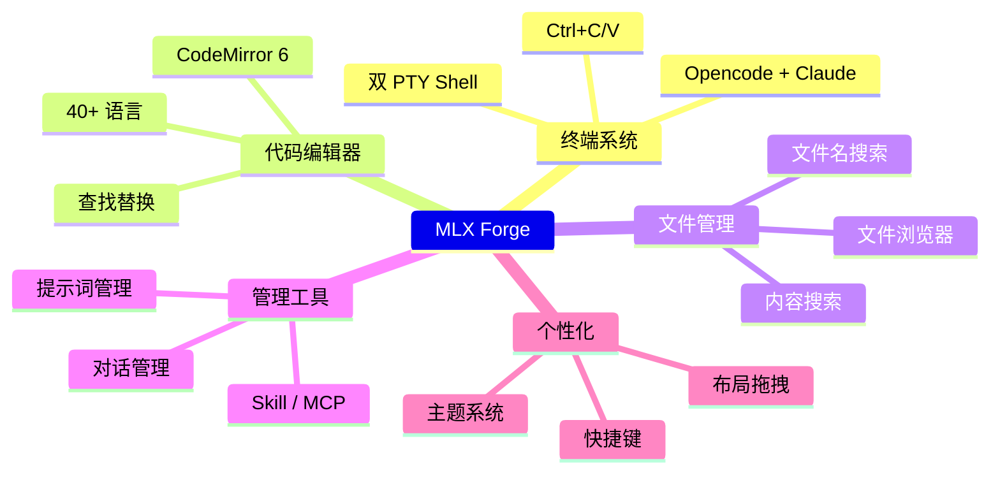

# MLX Forge — 功能指南



## 1. 🖥️ 双终端系统

Opencode 和 Claude CLI 工具在独立的 PowerShell PTY 终端中并行运行。

```mermaid
graph LR
    subgraph "渲染进程"
        XT[XTerm.js 5.3]
        TP[TerminalPanel]
    end
    subgraph "主进程"
        TM[TerminalManager]
        NP[@lydell/node-pty]
    end
    subgraph "操作系统"
        PS[PowerShell]
        OC[opencode CLI]
        CL[claude CLI]
    end
    TP -->|IPC| TM
    TM --> NP
    NP --> PS
    PS --> OC & CL
    PS -->|stdout| NP
    NP -->|onData IPC| XT
```

- **自动启动**：立即启动 opencode，Claude 延迟 3 秒启动
- **新建终端**：点击 `+` 选择 Claude、Opencode 或自定义命令
- **Ctrl+C**：复制选中文本（无选中时发送 SIGINT）
- **Ctrl+V**：从剪贴板粘贴
- **右键菜单**：复制/粘贴

---

## 2. 📝 代码编辑器（CodeMirror 6）

CodeMirror 6 驱动的全功能代码编辑器，40+ 语言语法支持。

- **查找替换**（`Ctrl+F`、`Ctrl+H`）
- **列编辑模式**（Alt+拖拽）
- **自动换行**、**十六进制查看器**、**行操作**
- **缩放**（`Ctrl+=` / `Ctrl+-`）
- **Markdown/PlantUML 预览**（Alt+M / Alt+U）

---

## 3. 📂 文件浏览器

类似 Windows 资源管理器的传统文件树。

- **右键菜单**：新建文件/文件夹、重命名、删除、复制、剪切、粘贴
- **慢双击改名**：单击选中→稍等约 1 秒→再次单击进入改名
- **F2**：重命名；**Delete**：删除
- **自动刷新**：通过 chokidar 检测文件系统变更
- **刷新按钮**：工具栏手动刷新

---

## 4. 🔍 文件名搜索（EverythingSearch）

全盘文件名索引搜索，对标 Everything。

- **索引引擎**：内存 Map 索引，通过 v8 序列化持久化到磁盘
- **首次扫描**：30-60 秒（后台运行，不阻塞 UI）
- **二次启动**：1-3 秒（加载缓存索引）
- **搜索查询**：1-50ms 响应
- **右键**：打开所在文件夹、复制路径、复制、剪切、重命名

---

## 5. 🔎 内容搜索（`Ctrl+Shift+F`）

跨文件文本内容搜索。

- **引擎**：优先使用 ripgrep（rg），不可用时回退到 Node.js
- **搜索范围**：项目目录下所有文本文件
- **结果**：按文件分组，展开查看行级匹配
- **点击**：在编辑器中打开匹配位置
- **索引延迟**：启动后 10 秒开始加载

---

## 6. 💬 对话管理

浏览、查看和恢复 Claude 与 Opencode 的对话。

- **Claude 页签**：读取 `~/.claude/` 数据
- **Opencode 页签**：读取 `opencode` SQLite 数据库
- **详情视图**：消息气泡 + Token 用量统计
- **恢复**：点击「恢复到终端」自动输入命令到当前终端
- **导出**：导出为 Markdown 文件

---

## 7. 💡 提示词管理（`Ctrl+Shift+M`）

分层目录式提示词库，以 `.md` 文件存储在 `prompts/` 目录。

- **三级视图**：列表 → 详情（Markdown 渲染） → 编辑（文本编辑）
- **右键**：新建提示词、新建分组、重命名、删除
- **持久化**：可执行文件同级的 `prompts/` 目录

---

## 8. 🎨 主题系统

3 套内置主题 + 自定义主题编辑器。

| 主题 | 说明 |
|-------|-------------|
| 暗黑 | Tokyo Night 风格 — 深藏蓝底色 |
| 白黑 | GitHub Light — 纯白底色 |
| 高对比度 | 深蓝底色 + 青色强调 |

**自定义主题**：实时编辑 19 个颜色变量和字体大小。

---

## 9. ⌨️ 快捷键

`Ctrl+Shift+/` 随时打开快捷键帮助面板。

| 快捷键 | 功能 |
|--------|------|
| `Ctrl+B` | 切换文件浏览器 |
| `Ctrl+Shift+F` | 内容搜索 |
| `Ctrl+Shift+M` | 提示词管理 |
| `Ctrl+Shift+P` | 切换项目 |
| `Ctrl+Shift+/` | 快捷键帮助 |
| `Ctrl+N/O/S/W` | 文件操作 |

---

## 10. 🔧 工具面板

通过视图菜单或 QuickTools 访问的其他工具：

- **Skill 管理**：浏览/安装/删除 Claude 技能
- **MCP 配置**：查看和编辑 MCP 服务器配置
- **浏览器**：内置 WebView 浏览器，支持书签
